# Dashwheel

**The car launcher for Android head units.** Map, music and live car data on one calm screen: seven dashboards you arrange yourself, 30+ widgets, four whole-design skins, an AI mechanic that explains warning lights, and your phone's calls and messages on the big screen. Built with Jetpack Compose, free and open source (GPL v3).

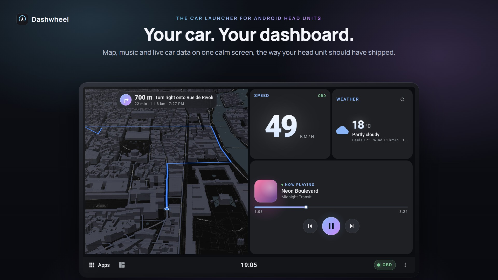

**[Download the latest APK](https://github.com/deviloufr-ai/ACP/releases/latest)** · Android 10+ · made for 1280x720 head units (ROCO K706 / FYT / QF units), also works on upright screens and phones.

## Screenshots

| | |
|---|---|
| 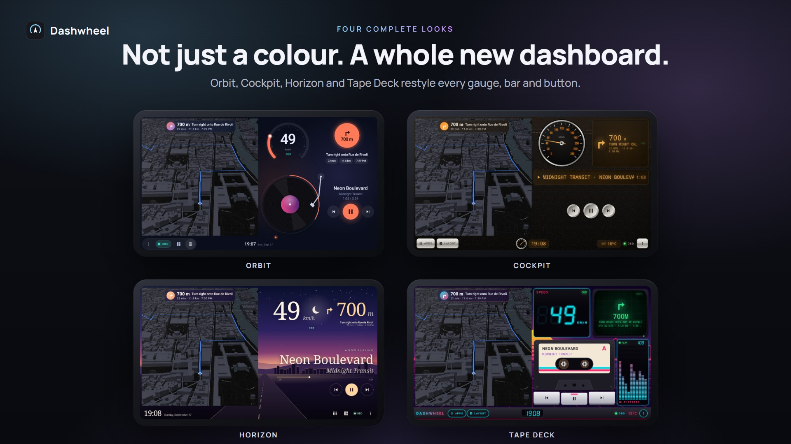 | 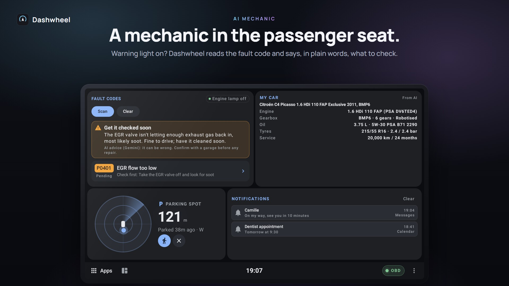 |
| **Live car data** from a Bluetooth OBD adapter and the head unit's CANbox | **AI mechanic**: fault codes explained in plain words |
| 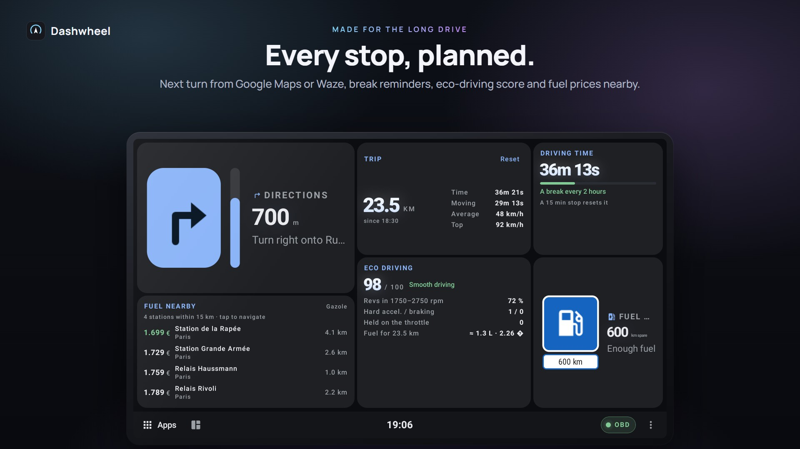 | 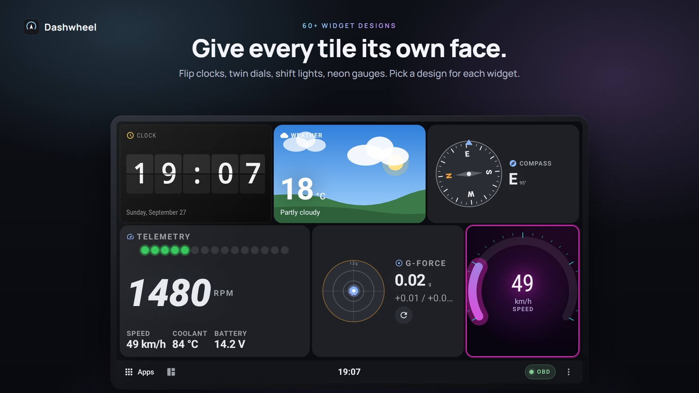 |
| **Road trip**: next turn, break reminder, eco score, fuel prices nearby | **60+ widget designs**, one per tile |
|  | 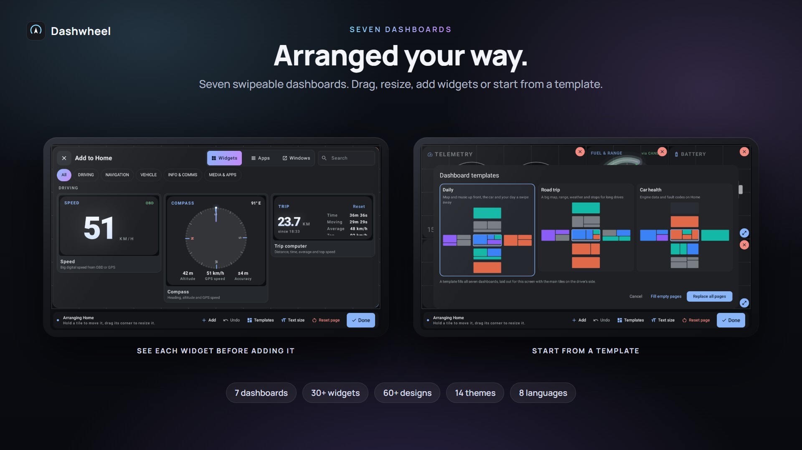 |
| **Four skins**: Orbit, Cockpit, Horizon, Tape Deck | **Seven dashboards**, live widget previews, templates |
| 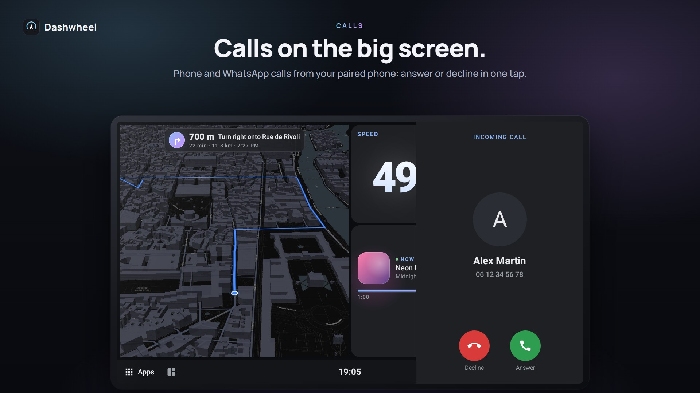 | 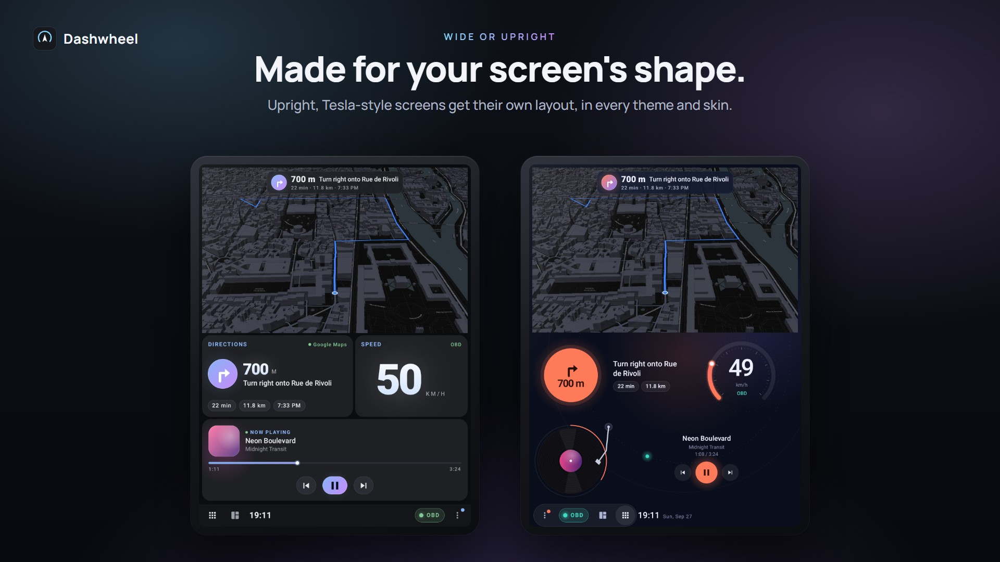 |
| **Calls** from the paired phone, answered from the screen | **Upright screens** get their own layout |
| 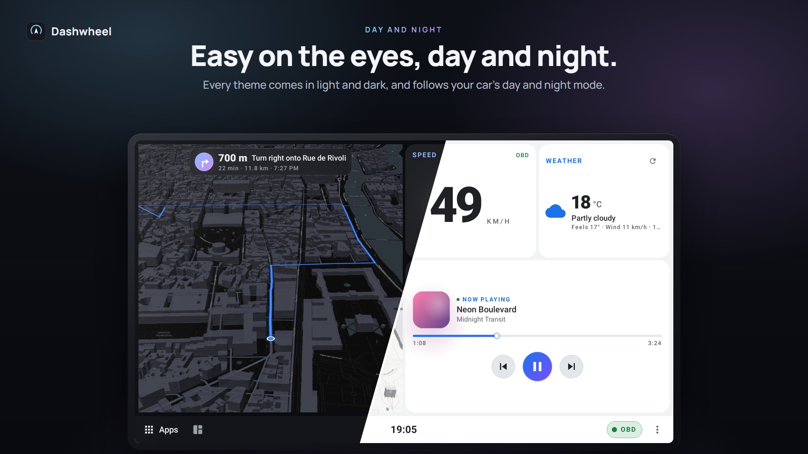 | 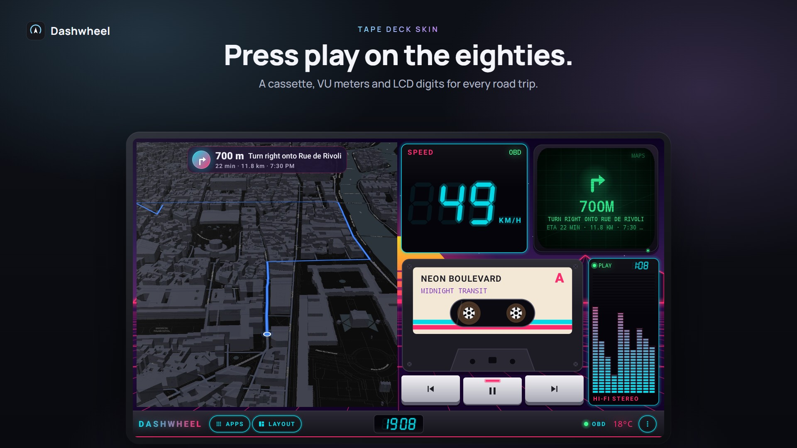 |
| **Day and night**: every theme in light and dark | **Tape Deck**, one of the four skins |

More in [`docs/screenshots/`](docs/screenshots/) (one slide per skin). The screenshots use **demo mode** (Settings → Advanced → Demo mode), a made-up drive through Paris. The emulator they were taken on cannot draw the map tile, so it shows a still render in the in-app map's style. [`tools/marketing/`](tools/marketing/) regenerates them.

## Key Features
- **Seven dashboards in a cross**: three side by side, plus two above and two below the middle one. Each is a free 12x7 grid (7x12 on an upright screen): hold a tile to move it, drag its corner to resize, 30-step undo, layout saved as JSON
- **Templates**: *Daily*, *Road trip* and *Car health* fill all seven dashboards at once, laid out for the screen with the main tiles on the driver's side; a first-run setup walks through the permissions
- **30+ built-in widgets** in five categories, each previewed live in the widget picker as it will look on the page, plus real Android AppWidgets, app shortcuts, launch bars and docked app windows
- **60+ widget designs**: flip clock, twin dials, shift lights, LCD, neon, fuel tank, car top view, radar, road sign... chosen per tile
- **14 themes, 4 of them whole-design skins** (Orbit, Cockpit, Horizon, Tape Deck), each with a light and a dark version that follow the car's day/night mode
- **Live car data**: ELM327 Bluetooth OBD (speed, revs, temperatures, load, fuel, voltage, fault codes read & clear) that reconnects by itself, and the head unit's own car data (doors, fuel level, lights, mileage, reversing, ignition, seat belt, tyre pressures) where the unit exposes it
- **AI mechanic** (Google Gemini, free API key): scans fault codes automatically, explains them in plain words with what to check first, and speaks the important ones; fetches your car's specs (oil, tyres, service plan) into **My car**
- **Car care**: particle filter health, engine warm-up, battery, servicing planner with spoken reminders, fuel to destination, fuel prices around the car (France)
- **In-app navigation**: a free MapLibre map (CARTO basemap, 3D buildings, Nominatim search, Valhalla routes) that hands turn-by-turn to Google Maps or Waze; the Directions tile reads their next turn
- **Phone link (Dashwheel Companion)**: the phone's notifications and messages (read aloud, quick or voice replies), phone and WhatsApp-style calls answered from the screen, where the car is parked, and a log of every drive with its eco-driving score; paired by QR code, end-to-end encrypted
- **Your own alerts instead of the head unit's pop-ups**: calls, doors, parking radar, climate, tyres and seat belt, each as a pill, card, banner, side panel or full screen, optionally spoken
- **Hands-free**: steering wheel buttons learned from the car and mapped to Dashwheel actions; volume keys and volume that follows speed
- **Upright screens**: Tesla-style portrait units get their own grid and layouts, in every theme
- **8 languages**: English, French, German, Spanish, Italian, Portuguese, Dutch, Polish
- **Drive lock**: arranging tiles, settings and pickers wait until the car has stopped
- **Updates from GitHub Releases**: shows the release notes, downloads on Wi-Fi, one tap to install
- **Root is optional**: features that need `su` or the unit's internal ADB (system-app install, boot logo, docked app windows, CANbox tiles, volume keys) only appear when such a shell is found; apps running inside a tile also need the PMPatch3 Magisk module (see [Other Apps on the Dashboard](#7-other-apps-on-the-dashboard))

### Project Structure

```
D:/android car launcher/
├── build.gradle.kts                              # Root build: AGP 8.13.2 + Kotlin 2.1.0 plugin versions
├── settings.gradle.kts                           # Project + repositories
├── gradle.properties                             # AndroidX / Gradle flags
├── gradlew, gradlew.bat                           # Gradle wrapper scripts
├── gradle/wrapper/gradle-wrapper.properties       # Pins Gradle 8.13 (jar generated on first sync/CI)
├── app/
│   ├── build.gradle.kts                           # Module dependencies & Android config
│   ├── proguard-rules.pro
│   └── src/main/
│       ├── AndroidManifest.xml                    # Launcher + HOME filters, permissions, services
│       ├── java/com/openauto/dash/
│       │   ├── MainActivity.kt                    # Entry point, wake flags, multi-window tracking
│       │   ├── AutomotiveDashboard.kt             # Root composable: pages, undo, OBD loop, dialogs
│       │   ├── DashboardModel.kt                  # Grid model, DashboardItem/BuiltinKind, persistence
│       │   ├── DashboardGrid.kt                   # Grid rendering, drag-move / drag-resize gestures
│       │   ├── AddSheet.kt / WidgetCatalog.kt     # "+" add sheet (live widget previews, apps, windows) + the catalogue's names/icons
│       │   ├── AppLauncher.kt / AppTiles.kt       # App enumeration + full-screen app drawer
│       │   ├── TopBar.kt                          # Minimal bar: Apps, layout menu, clock, OBD dot, ⋮ menu
│       │   ├── DashTheme.kt / DashThemePickerDialog.kt  # 12 palettes (incl. Aurora Glass) + picker UI
│       │   ├── Skins.kt / SkinKit.kt              # Skin dispatch (background, top bar, widgets, Maps frame) + shared live values
│       │   ├── OrbitSkin.kt / CockpitSkin.kt / HorizonSkin.kt / TapeDeckSkin.kt  # The four whole-design skins
│       │   ├── WindowFrameOverlay.kt              # Skin frame drawn in an overlay window over the docked Google Maps window
│       │   ├── OriginalTiles.kt                   # Legacy widget renderers used by the "Original" theme
│       │   ├── MapLibrePanel.kt                   # In-app MapLibre GL navigator (free, no API key)
│       │   ├── DirectionsTile.kt / NavDirections.kt # Google Maps/Waze turn-by-turn via notification parsing
│       │   ├── ObdBluetoothManager.kt / ObdParser.kt / ObdCodes.kt # ELM327 link, pure reply decoding, DTC table
│       │   ├── McuReader.kt                       # Rooted CANbox reader: doors, learned fuel mapping
│       │   ├── TelemetryTiles.kt / VehicleTiles.kt / DriveTiles.kt # OBD/CANbox/driving-instrument cards
│       │   ├── CarMediaController.kt / MediaTile.kt # MediaSessionManager bridge + media card
│       │   ├── MediaNotificationListenerService.kt  # Shared listener: media + directions + notifications
│       │   ├── InfoTiles.kt / WeatherRepo.kt       # Clock/weather/calendar/dial/notifications/audio cards
│       │   ├── SystemWidgetPanel.kt               # Hosts real Android AppWidgets inside dashboard tiles
│       │   ├── SplitLauncher.kt / SplitAccessibilityService.kt # System split-screen + pane swap
│       │   ├── AdbInstaller.kt / SystemInstaller.kt # Optional priv-app self-install (Magisk / root ADB)
│       │   ├── PhoneLink.kt / PhoneLinkUi.kt       # Phone link: dials the companion app on the hotspot, reply sheet, pairing QR
│       │   ├── PhoneCallOverlay.kt                # The phone's calls: caller card with answer / decline / hang up, over any app
│       │   ├── DriveLog.kt                        # Drive log: each trip + its eco-driving score, saved and sent to the phone
│       │   ├── UpdateManager.kt                   # GitHub Releases auto-update
│       │   └── AutoDriveReceiver.kt               # Auto-launch on Bluetooth connect (see Troubleshooting)
│       └── res/
│           ├── drawable/                          # Vector icons + adaptive-icon layers
│           ├── mipmap-anydpi-v26/ic_launcher.xml  # Adaptive launcher icon (+ ic_launcher_round)
│           ├── values/                            # colors.xml, themes.xml, strings.xml
│           └── xml/                               # file_paths.xml, split_accessibility_config.xml
│   └── src/test/java/com/openauto/dash/       # JVM unit tests: grid, OBD decoding, directions, layout JSON
├── companion/                                    # Dashwheel Companion, the phone app (notification listener + link server)
├── link/                                         # Plain-Kotlin protocol shared by both apps: messages, pairing, encrypted channel (+ tests)
└── .github/workflows/                            # GitHub Actions CI/CD
    ├── build.yml                                 # Builds + releases the APK on push to main
    └── lint.yml                                  # Android Lint + unit tests
```

## Toolchain

| Tool | Version |
|------|---------|
| Android Gradle Plugin | 8.13.2 |
| Gradle | 8.13 |
| Kotlin | 2.1.0 (+ Compose compiler plugin) |
| compileSdk | 35 |
| targetSdk | 34 |
| minSdk | 29 (Android 10) |
| Gradle JDK | 17–21 (see note) |

> **JDK note:** AGP 8.13.2 / Gradle 8.13 run on JDK 17–21, not JDK 25. The latest Android Studio bundles JBR 25 for the IDE, but the **Gradle JDK** is a separate, per-project setting. If Studio flags "Java 25 is not supported", set **Settings → Build, Execution, Deployment → Build Tools → Gradle → Gradle JDK → Download JDK → 21** and re-sync. The IDE keeps using JBR 25; only the Gradle daemon uses 21.

## Setup Instructions

### Prerequisites
1. **Android Studio (latest)** with a **Gradle JDK of 17–21** (Studio can download it)
2. **Android SDK** (platform 35, build-tools 35, platform-tools)

### Building with Android Studio
1. Open `D:/android car launcher` in Android Studio.
2. Let Gradle sync — this downloads dependencies and generates the Gradle wrapper JAR automatically. If it complains about Java 25, set the Gradle JDK to 21 (see the JDK note above) and re-sync.
3. Build the debug APK: `Build → Build Bundle(s) / APK(s) → Build APK(s)`.
4. Install `app/build/outputs/apk/debug/app-debug.apk` on a device or emulator.

### Building from the command line
The wrapper JAR (`gradle/wrapper/gradle-wrapper.jar`) is intentionally **not** committed. Generate it once with a locally installed Gradle (8.13), or let Android Studio create it on first sync:

```bash
gradle wrapper --gradle-version 8.13
```

Then build:

```bash
./gradlew assembleDebug
```

On Windows PowerShell use `.\gradlew.bat assembleDebug`. The output APK is at `app/build/outputs/apk/debug/app-debug.apk`.

> If you don't want to install Gradle locally at all, just push to GitHub — the CI build below provisions Gradle, generates the wrapper, and produces the APK for you.

## Features Overview

### 1. Dashboard Grid — 7 Dashboards, Free Placement
`AutomotiveDashboard` owns seven swipeable dashboards laid out as a cross (three side by side; the middle one also swipes up to two more and down to two more), each a 12×7 cell grid, 7×12 on an upright screen (`DashboardModel.kt`, `ScreenShape.kt`). Tiles are placed, long-press-dragged to move, or resized via a corner handle (`DashboardGrid.kt`), with live snap-preview and collision-aware move/swap/nudge (`DashboardStore.moveResolving`). Layouts persist as JSON in SharedPreferences and survive app restarts; up to 30 steps of undo are kept in memory. ⋮ → *Edit dashboards* → **Add** opens the add sheet (`AddSheet.kt`): widgets from the catalogue (each previewed live), apps, and app windows; ⋮ → *Templates* fills every dashboard from a template (`DashTemplates.kt`).

While the launcher shares the screen with another app (system split-screen), pages automatically switch to a stacked vertical-scroll layout instead of the free grid.

### 2. Widget Catalogue (32 built-in cards)
`WidgetCatalog.kt` groups every built-in widget by category; each can wear any of 60+ designs (`WidgetDesigns.kt`):
- **Driving**: speed, compass, trip computer, g-force, eco driving, break reminder
- **Navigation**: in-app MapLibre map, Google/Waze directions, Maps window dock (pins the floating Maps window onto a tile via the head unit's ADB socket), parking spot, fuel to destination, fuel prices
- **Vehicle**: telemetry, fault codes, all OBD data, fuel & range, doors, CAN monitor, particle filter, engine warm-up, battery, my car, servicing, car status, tyres
- **Info & Comms**: clock, weather, agenda, quick dial, notifications, audio
- **Media & Apps**: music player, app launch bar

### 3. In-App Navigation & Directions
`MapLibrePanel.kt` is a free, no-API-key in-app navigator: MapLibre GL rendering over the CARTO dark-matter basemap, Nominatim geocoding, Valhalla routing, and 3D building extrusion, with a GPS-tracking camera. Tapping **Start** hands off turn-by-turn guidance to Google Maps via the free `google.navigation:` intent (falling back to a generic `geo:` intent) — full embedded Google Maps was attempted but abandoned since embedding requires platform signing.

`NavDirections.kt` reads the ongoing turn-by-turn notification Google Maps/Waze post while navigating (via the same notification-listener service used for media) and parses instruction text, distance and ETA — even when the notification uses a custom RemoteViews layout with empty extras. `DirectionsTile.kt` renders this as a full card or as a compact banner floated over the map tile.

### 4. OBD-II + CANbox Vehicle Telemetry
`ObdBluetoothManager.kt` connects to an ELM327 adapter over Bluetooth SPP/RFCOMM and polls every 500ms: speed, RPM, coolant/intake temp, throttle, engine load, fuel level, and control-module voltage, plus **DTC read & clear** (mode 03/04) with human-readable descriptions from `ObdCodes.kt` (extra detail for Citroën C4 Picasso VTi/THP/HDi engines).

`McuReader.kt` optionally taps the head unit's CANbox/MCU (requires root, tails `logcat -s mcu_services`) to expose live door/bonnet/tailgate state and a user-calibrated fuel-level mapping for vehicles whose OBD doesn't report fuel.

### 5. System Media Integration
`CarMediaController.kt` bridges Android's `MediaSessionManager` into a `StateFlow<MediaState>`, auto-selecting whichever session is actually playing, exposing title/artist/artwork/duration and Play/Pause/Next/Previous transport controls. Reading other apps' sessions requires **Notification access**, granted once via system settings — the same listener service also powers the Directions tile and a general notifications feed.

### 6. System Split-Screen + Pane Swap
This head unit's ROM ignores AOSP windowing APIs but honors SystemUI's manual recents-drag split path, so `SplitLauncher.kt` drives it via an `AccessibilityService` (`SplitAccessibilityService.kt`, enabled once under Settings → Accessibility): it triggers the same global action a manual split gesture would, then launches the target app (or a saved pair) adjacent to the dashboard. A floating overlay button (or a FAB in the dashboard) lets you swap which app occupies which side, since this ROM has no working divider double-tap swap gesture.

### 7. Other Apps on the Dashboard
Besides app icons (a tap opens the app full screen), another app can live on a page in three ways, all under **Add → Windows**. Only the ones this head unit allows are offered.

| | **In a window** | **Inside the tile** | **Side by side** |
|---|---|---|---|
| **What you get** | The app in a floating window laid over the tile (`PipAnchor.kt`, `AppWindowTile.kt`) | The app drawn inside the tile itself, like a widget, and touched there (`EmbeddedApp.kt`) | Two apps opened together in system split screen (section 6) |
| **Swiping to another page** | The window moves to a hidden display and keeps running | The app keeps running out of sight: music or guidance carries on | – |
| **Removing the tile** | The window closes once no tile of that app is left | The app closes with its last tile | – |
| **The same app on several pages** | – | Yes: the app runs once and shows on the tile of the page on screen (Maps and YouTube Music on two dashboards, say) | – |
| **The unit's keys (Home, Back...)** | Work as usual | Work as usual: opening the app on its tile would send them there, so they are handed back to the main screen after each launch and touch, and Home / Back pressed meanwhile are redone there (through the accessibility service) | – |
| **Tile zoom** | No | Yes, it scales the app's text and buttons | Yes |

**What each one needs**

| Requirement | **In a window** | **Inside the tile** | **Side by side** |
|---|---|---|---|
| **Root shell** (Magisk `su`, or the unit's internal root ADB on port 9876) | Required: every window is placed and moved through it | Required on the K706: the app always opens full screen first and is moved into the tile with `am display move-stack` | Not needed |
| **PMPatch3 Magisk module** (Zygisk on, Magisk 24 or newer) | Not needed | Required: it makes Android grant Dashwheel the firmware's system permissions. Settings → Advanced → *System permissions* downloads it from its GitHub release, checks it and installs it | Not needed |
| **`INTERNAL_SYSTEM_WINDOW`** (open an app on Dashwheel's own display) | Not needed | Required: the option is hidden without it | Not needed |
| **`INJECT_EVENTS`** (pass touches to the app) | Not needed | Needed for touch; without it the app shows but can't be touched | Not needed |
| **A reboot** after PMPatch3 is installed | – | Required: PMPatch3 and Zygisk start with the unit. If Android still holds the permissions back after it, Dashwheel reinstalls itself once to get them | – |
| **Accessibility service** (Settings → Accessibility → Dashwheel) | Not needed | Not needed | Required: it opens the two apps together |
| **Firmware support** | Floating (freeform) windows | Apps on additional displays (`activities_on_secondary_displays`) | Android split screen |
| **The app itself** | Must accept being resized into a window | Must be openable from the launcher; apps that block screen capture (streaming video, banking) show black | Must accept split screen |
| **How to check** | Add → Windows shows *In a window* | Settings → Advanced → *System permissions* says *Granted*, and Add → Windows shows *Inside the tile* | Always offered |

**With or without root**

| Mode | **With root** | **Without root** |
|---|---|---|
| **In a window** | Works | Not offered: Android gives apps no other way to place another app's window |
| **Inside the tile** | Works with PMPatch3 installed | Not possible: PMPatch3 needs Magisk, and the firmware's own key isn't available to sign Dashwheel with |
| **Side by side** | Works | Works the same way |

The K706's built-in root ADB is enough for *In a window* without Magisk; only Magisk unlocks all three. With neither, the Windows tab offers *Side by side* only.

A few rules hold for all of them. Android runs one copy of each app, so an app can't be in a window and inside a tile at the same time: the tile wins and the window tile stays empty. Opening the app from the app drawer takes it out of its tile until you come back to that page. *Google Maps inside* in the widget catalogue is the same mechanism with Google Maps built in, and the *Maps window* widget and the Maps dock layouts are *In a window* for Maps.

### 8. Optional Priv-App Install
`SystemInstaller.kt`/`AdbInstaller.kt` can self-install the APK into `/system/priv-app`, either via `su`/Magisk (preferring a systemless Magisk module) or by talking to the head unit's internal root ADB socket. This is opt-in only (Settings → Advanced → System app), mainly useful for the `BIND_APPWIDGET` priv-app permission and the split-swap overlay window — it does **not** enable embedding Google Maps; that needs the PMPatch3 route in section 7.

### 9. Phone Link (Dashwheel Companion)
The driver's phone shares its connection with the head unit over Wi-Fi. **Dashwheel Companion** (`companion/`, shipped as `dashwheel-companion.apk` in every release) runs on the phone:
- A `NotificationListenerService` reads the phone's notifications, including messaging conversations (`MessagingStyle`), and answers them through each app's own reply / mark-as-read actions (`RemoteInput`), the same ones Android Auto and smartwatches use.
- A foreground service listens on TCP port 47810. The launcher's `PhoneLink` finds the phone at the Wi-Fi network's default gateway (Android 11+ randomises the hotspot subnet), dials it, and redials whenever the network changes.
- **Pairing**: Settings → Phone → *Pair a phone* shows a QR code (`dashwheel://pair?…`) carrying a random 32-byte secret. The phone scans it and the driver confirms. Every connection then proves both sides hold that secret (HMAC over the handshake), agrees fresh keys with ephemeral ECDH P-256, and encrypts every frame with AES-256-GCM (`link/`, unit-tested). Either side can revoke the pairing.
- On the head unit, the phone's notifications join the Notifications widget. Tapping one opens a sheet to read it aloud, answer with a quick reply or dictation, mark it read or clear it on the phone.
- **Calls**: the companion follows the phone's call state (`PHONE_STATE`), finds the caller in the contacts, and answers or ends the call through `TelecomManager` when asked (`PhoneCalls.kt`). Calls **in an app** (WhatsApp, Signal, Telegram, Messenger…) never reach the phone's call state, so the companion reads them from the app's own call notification (`CallNotification.kt`, through the notification listener: Notification access is what makes them show) and answers / declines / hangs up with the buttons that notification carries (Android 12's CallStyle intents, else the actions told apart by their titles). On phones where such a call also reaches the call state (a Samsung), nameless and without a number, the app's notification wins: it knows the caller, and Telecom ignores answer / end requests for a call it doesn't manage. The companion's status line says which of the two the car was told. When the same app is installed on the head unit (a WhatsApp linked to the phone's account rings there by itself, with the unit's speakers, mic and screen: the way to take its video calls), the head unit leaves the call to it and shows no card. On the head unit, `PhoneCallOverlay` shows a card with the caller, *Answer* and *Decline*, then a slim bar with the duration and *Hang up*. It is its own overlay window, so it appears over any full-screen app (needs "display over other apps", granted through the head unit's shell when possible, otherwise from Settings → Phone); without it, a popup over the launcher. The call's **sound stays on the head unit's Bluetooth hands-free**: pair the phone with the head unit's Bluetooth as well.

- **Where's my car**: every place the car comes to a stop (and the spot saved on the Parking tile) is sent to the phone (`CarWhereabouts.kt`); the companion shows the last one with *Map* and *Walk there*.
- **Drive log**: the head unit logs each drive as the Trip tile counted it (distance, time, moving time, average and top speed) together with the Eco driving card's verdict (score, revs in the relaxed band, hard accelerations / brakings, fuel estimate at the car's usual consumption and the driver's fuel price). A drive ends by itself after ten minutes standing still, when the engine has been off long enough for the eco card to close its drive (OBD), or when the driver resets the Trip tile; the trip under way is saved every half minute, so a unit switched off mid-drive carries it on when it comes back within those ten minutes (`DriveLog.kt`, last 50 drives). While linked, the drive under way is reported to the phone as it goes and once more when it ends, and the whole log is sent when the link comes up; the companion keeps the last 100 in its **Drives** section (`DriveJournal.kt`).

On Android 13+, a sideloaded app's Notification access is a "restricted setting": on the phone, open App info → ⋮ → *Allow restricted settings* first. The companion app shows this step.

### 10. In-App Auto-Update
`UpdateManager` keeps the app current from GitHub Releases:
- On launch it queries `https://api.github.com/repos/deviloufr-ai/ACP/releases/latest`.
- **Version tracking**: the installed `versionCode` is set by CI to the Actions **run number**; the latest build number is parsed from the release tag (`v1.0.42` → `42`). A higher number means an update is available.
- If newer, a dot on the ⋮ menu and a Settings row offer the update (downloaded ahead on an unmetered network); tapping it shows the release notes, then **Update now** → it downloads the release's launcher APK (never `dashwheel-companion.apk`) via `DownloadManager` and launches the system installer (Android always shows its own install confirmation).

> Android cannot install silently without device-owner privileges, so "auto-update" means auto-check + auto-download + a one-tap, OS-confirmed install. The first time, the user must allow "install unknown apps" for Dashwheel (the app opens that settings screen for them).

**Important — signing:** an update APK can only replace the installed app if both are signed with the **same key**. CI's debug key is regenerated every run, so you must add a persistent release keystore (below) for updates to actually install over each other.

#### Release signing setup (required for OTA updates)
1. Generate a keystore once:
   ```bash
   keytool -genkeypair -v -keystore release.keystore -alias openauto \
     -keyalg RSA -keysize 2048 -validity 10000
   ```
2. Base64-encode it:
   ```bash
   base64 -w0 release.keystore > release.keystore.b64   # Linux
   # macOS: base64 -i release.keystore -o release.keystore.b64
   ```
3. In the GitHub repo, add **Settings → Secrets and variables → Actions**:
   - `KEYSTORE_BASE64` — contents of `release.keystore.b64`
   - `KEYSTORE_PASSWORD` — the store password
   - `KEY_ALIAS` — `openauto`
   - `KEY_PASSWORD` — the key password

When these secrets are present, CI signs every release APK with that key; when they are absent, it falls back to the debug key (installs fine, but cross-version updates won't).

### 11. Theming
`DashTheme.kt` provides 14 selectable themes, each in a dark and a light version (Auto follows the car's day/night mode), switchable live from Settings → Look: **Auto** (follows system day/night), **Original** (the first launcher look — flat cards, twin-needle gauges, rendered by `OriginalTiles.kt`), **Aurora Glass** (glass panels, glowing gauges, cyan/violet gradient), **Neon Dark**, **Clean Light**, **Dark Glass**, **Sporty** (black + red), **Floating** (no tile backgrounds), **Mistral** (the C4 Picasso's central cluster: cold-white numerals on smoked graphite, amber alerts) and **Zénith** (pearl grey, white panels, one deep blue accent).

Four more are whole-design **skins** (`DashSkin`): **Orbit** (everything round: a spinning record, ring gauges, bubbles), **Cockpit** (chrome-ringed analog dials and toggle switches on stitched leather), **Horizon** (no widgets, just an evening scene with the road ahead and typography on it) and **Tape Deck** (80s synthwave head unit: cassette, neon grid, seven-segment digits). A skin draws its own page background, top bar and the main widgets (speed, telemetry, music, directions, clock, weather, fuel, app shortcuts, launch bar); `Skins.kt` routes those tiles to the skin's file and every other tile keeps its standard renderer on the skin's palette. When Google Maps is docked, the skin also shapes and decorates it (a round porthole, a chrome bezel, a CRT bezel, a soft fade) from an overlay window above it (`WindowFrameOverlay.kt`); touches pass straight through to Maps.

## Architecture

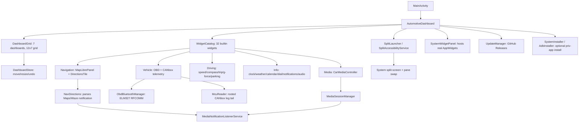

## Safety Guidelines
- **Dark Themes by Default**: Auto/Aurora/Neon/Dark Glass/Sporty all reduce glare while driving.
- **High-Contrast Controls**: large touch targets throughout the grid and media transport.
- **Screen Kept On**: the screen stays awake while the dashboard is active.
- **Large Typography**: hero telemetry (speed, distance-to-turn) uses oversized readouts with warning thresholds.

## Permissions Required

| Permission | Purpose |
|------------|---------|
| BLUETOOTH / BLUETOOTH_ADMIN / BLUETOOTH_CONNECT | OBD-II adapter connection |
| ACCESS_FINE_LOCATION / ACCESS_COARSE_LOCATION | In-app navigation, weather, driving-instrument widgets |
| READ_CALENDAR | Calendar widget (requested at runtime when added) |
| READ_CONTACTS | Quick Dial widget (requested at runtime when added) |
| INTERNET | Map tiles, weather, media, updates |
| WAKE_LOCK / DISABLE_KEYGUARD | Keep screen on while driving |
| FOREGROUND_SERVICE / FOREGROUND_SERVICE_DATA_SYNC | Continuous telemetry |
| POST_NOTIFICATIONS | Notifications on Android 13+ |
| REQUEST_INSTALL_PACKAGES | Install downloaded update APKs |
| BIND_APPWIDGET | Hosting real Android AppWidgets in dashboard tiles |
| SYSTEM_ALERT_WINDOW | Floating split-screen swap button; the skins' frame over the docked Maps window (granted through the dock's shell when missing) |
| Notification access (granted in Settings) | Read media sessions, parse Maps/Waze directions, general notifications feed |
| Accessibility service (granted in Settings, optional) | Drive system split-screen + pane swap |

## GitHub Actions CI/CD

The project builds automatically on GitHub Actions — no local Android Studio required.

### Workflow Files
- **`.github/workflows/build.yml`** — builds the **release** APK, uploads it as an artifact, and (on push to `main`) publishes a **GitHub Release** the in-app updater reads.
- **`.github/workflows/lint.yml`** — runs Android Lint and unit tests.

### How It Works
Each build job: checkout → set up JDK 21 → set up Android SDK (explicit packages, no obsolete `tools`) → **set up Gradle 8.13** → `gradle wrapper` → decode the optional signing key → `./gradlew assembleRelease` (with `VERSION_CODE`/`VERSION_NAME` from the run number) → upload artifact → publish a release tagged `v1.0.<run_number>` with the APK attached. Because CI provisions Gradle itself, the wrapper JAR is not committed.

### Get the APK
- **Latest release** (what the app auto-updates from): https://github.com/deviloufr-ai/ACP/releases/latest
- **Per-run artifact**: Actions tab → a successful run → `openauto-dash-apk`.
- Install on a device: `adb install Dashwheel-<version>.apk`

## Troubleshooting

### OBD-II Connection Issues
1. Pair the ELM327 adapter with the phone in Bluetooth settings first.
2. Grant Bluetooth permission when the app prompts (Android 12+).
3. Ensure the adapter's name contains `OBD`, `ELM`, or `327` so auto-detect finds it.
4. Confirm it works with a known OBD-II app before debugging here.

### Media / Directions / Notifications Not Working
1. Play audio/video from a supported app, or start turn-by-turn in Google Maps/Waze, so there is an active notification to read.
2. Open the widget's **Grant Media Access** action and enable Notification access for Dashwheel — this one grant powers media, directions, and the notifications feed.
3. Return to the app — the relevant tile should populate.

### Split-Screen / Swap Not Working
1. Enable the accessibility service once under **Settings → Accessibility → Dashwheel**.
2. If the service isn't enabled, split launches fall back to a movable freeform window instead of true split-screen.
3. The swap overlay button needs `SYSTEM_ALERT_WINDOW`; installing as a priv-app auto-grants this on some ROMs.

### Auto-Launch on Bluetooth Connect Is Unreliable
`AutoDriveReceiver` listens for `ACTION_ACL_CONNECTED`, but Android 8+ (this app targets `minSdk 29`) no longer delivers most implicit broadcasts to manifest-declared receivers — this only works if the app process is already running. Treat it as a best-effort convenience, not a guaranteed auto-launch.

## License
Copyright (C) 2026 deviloufr-ai

Dashwheel (the launcher and the Companion app) is free software: you can redistribute it and/or modify it under the terms of the GNU General Public License as published by the Free Software Foundation, either version 3 of the License, or (at your option) any later version. It is distributed WITHOUT ANY WARRANTY; see the [LICENSE](LICENSE) file for the full text.

## Support
- [Jetpack Compose Guidelines](https://developer.android.com/jetpack/compose)
- [OBD-II PIDs](https://en.wikipedia.org/wiki/OBD-II_PIDs)
- [MediaSessionManager](https://developer.android.com/reference/android/media/session/MediaSessionManager)
- [MapLibre GL Android SDK](https://maplibre.org/maplibre-native/android/)

---

**Project Status**: Compiles to a debug/release APK via Gradle/CI; actively evolving, in on-device integration testing on a real head unit.

**Last Updated**: 2026-09-27
